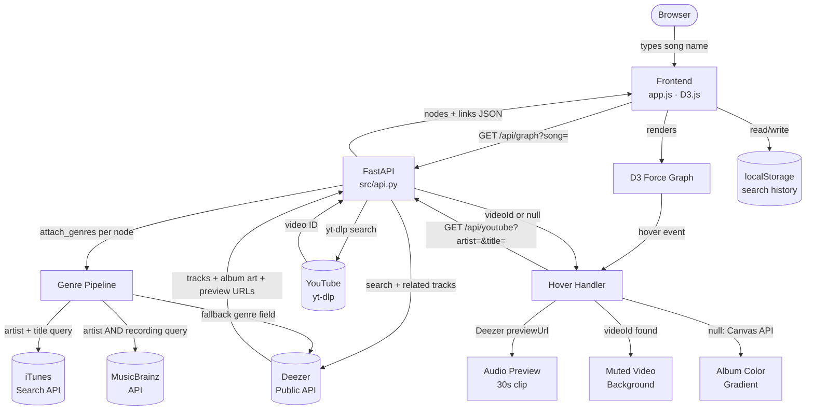

# 🎵 WaveForm Web

## Base Project

This project extends the **AI110 Music Recommender Simulation** — a content-based filtering system that scored songs against a user profile using genre, mood, energy, and valence weights and returned ranked top-k matches from a local CSV catalog. That system was a CLI-only tool with no external data, no audio, and no visualization. WaveForm Web replaces the static CSV lookup with live streaming APIs, adds an interactive visual graph, and integrates real audio previews and music video playback.

---

## Problem Statement

The original simulation had one core limitation: it only knew about the 20 songs in a hand-curated CSV file. It couldn't discover new music, it had no sense of what songs actually sounded like, and its genre/mood labels were manually assigned. Real music discovery requires live data, and meaningful music discovery requires understanding the *relationships* between songs — not just scoring them against a static profile.

WaveForm Web solves a different but related problem: **given any song, what is its musical neighborhood?** Instead of asking "what matches my profile," it asks "what else exists in this song's sonic space?" The graph makes those relationships visible and explorable. The AI layer answers the harder question of *characterizing* each node — what genre is this, and is the video being shown actually the right one?

---

## Project Summary

WaveForm Web is a music discovery app that lets you search any song and explore its "sonic universe" — a live, interactive graph of related tracks, artists, and albums built from real streaming data. When you hover over any node in the graph, a 30-second Deezer preview plays and the background transforms: a music video plays silently behind the graph, or the album's dominant color washes across the screen as a fallback. Genres are detected automatically using a multi-source AI pipeline (iTunes → MusicBrainz → Deezer) and displayed on hover. Recent searches are saved locally so you can jump back to previous sessions instantly.

---

## Architecture



**Major components:**
- `src/api.py` — FastAPI app; `/api/graph`, `/api/youtube`, `/api/suggest` endpoints
- `src/graph_builder.py` — builds D3-compatible node/link JSON from Deezer data
- `src/itunes_client.py` — iTunes + Deezer genre detection, persistent HTTP client
- `src/musicbrainz_client.py` — MusicBrainz tag lookup, rate limiting, artist disambiguation
- `static/app.js` — D3 force simulation, hover audio/video logic, legend filters, search history

---

## How The System Works

### End-to-End Integration

Every feature in WaveForm Web is a link in a single chain. Here is exactly how a search turns into an interactive graph with audio and video:

1. **User types a song name** → frontend sends `GET /api/graph?song=Uptown+Funk`
2. **`graph_builder.py` queries Deezer** → finds the top matching track, gets its Deezer track ID
3. **Three parallel Deezer requests fire at once** using `asyncio.gather`:
   - Other songs by the same artist (same-artist pool)
   - Other tracks on the same album (same-album pool)
   - Deezer's "related tracks" for that song (similar-style pool)
4. **`attach_genres()` runs on every node in parallel** — each node independently queries the genre pipeline
5. **The assembled JSON** (nodes with genres, artwork, preview URLs + link edges) is returned to the browser
6. **D3 renders the force graph** — nodes repel each other; edges pull connected nodes together; clusters form naturally
7. **User hovers a node** → two things happen simultaneously in the browser:
   - `extractDominantColor()` immediately starts sampling the node's album art via Canvas API
   - `fetch('/api/youtube?...')` sends an async request to the backend
8. **Backend runs `_yt_search_sync` in a thread pool** (yt-dlp can't run in async context directly) → searches YouTube for an official music video
9. **Two outcomes**:
   - Video found → muted iframe appears as background; color gradient hidden
   - No video → color gradient (already computed in step 7) fades in; background is never black

Every step depends on the previous one. If Deezer returns no results, the graph is empty. If genre detection fails all three tiers, the tooltip shows "Unknown." If YouTube returns null, the color fallback is already running. The system degrades gracefully at every joint.

---

### Genre Detection — Why Each Decision Was Made

**Why iTunes first?**
Deezer's genre field returns coarse labels ("Pop", "Rap/Hip Hop") that are too broad to be useful. iTunes indexes commercial releases with specific genre metadata and handles non-English releases better than MusicBrainz. A search for "YOASOBI" returns "J-Pop" from iTunes; MusicBrainz has sparse coverage for newer Japanese artists.

**Why MusicBrainz second?**
MusicBrainz is crowdsourced and community-maintained. It has the most specific genre vocabulary (tags like "hypnagogic pop", "alternative rap", "cloud rap") but is also the noisiest — single contributors can add any tag. It's better than Deezer but worse than iTunes for most cases.

**Why the vote threshold (≥ 2)?**
A real failure case: before this threshold was applied, Bruno Mars returned the genre "Relic Inn" — a single-vote tag from one contributor (likely a joke or venue name). After enforcing ≥ 2 votes, the system only trusts tags that at least two independent contributors agreed on. This isn't perfect, but it filters the worst noise.

**Why artist + title anchoring?**
Searching MusicBrainz by artist name alone is unreliable. "MIKE" matches dozens of unrelated artists — blues musicians, session players, tribute bands. The query `artist:"MIKE" AND recording:"Leadbelly"` narrows to the specific recording, which resolves to the correct underground rapper. Without the title anchor, the genre for that song returned results for wrong artists.

---

### Video Selection — Why Each Decision Was Made

**Why yt-dlp instead of YouTube Data API?**
The YouTube Data API costs 100 quota units per search, with a 10,000/day cap. During active development, a single restart-and-test cycle would use ~500 units. The daily quota was exhausted within hours. yt-dlp scrapes the same YouTube search results with no API key and no quota limit.

**Why the keyword filter?**
A search for "Bruno Mars Uptown Funk official video" returns not just the official video but also lyric videos, audio-only uploads, slowed/reverbed edits, reaction videos, and covers. Without filtering, the system would often show a lyric video (black screen with scrolling text) instead of the actual music video. The filter rejects any result whose title contains keywords like "lyrics", "audio", "cover", "reaction", "slowed", "nightcore", "live at", etc.

**Why the color fallback?**
Some songs (especially underground or independent releases) have no official music video on YouTube. Showing a black screen when no video is found would look broken. The Canvas API samples the album art at 10×10 pixels, extracts the center pixel color, and uses it as the basis for a radial gradient — so even songs without videos produce a visual response that reflects the album's aesthetic.

---

## Guardrail Experiments

The system has two guardrails that prevent bad outputs from reaching the user. Each is documented below with the conditions it was designed to handle, the expected behavior, and a concrete test.

---

### Guardrail 1 — Video Authenticity Filter (`_is_real_mv`)

**What it guards against:** YouTube search returns many results for a song query that are not official music videos — lyric videos, fan edits, audio-only uploads, covers, reactions, live performances. Showing any of these would be misleading and degrade the experience.

**How it works:** Every YouTube search result is evaluated by `_is_real_mv(video_title, artist, title)` before being accepted. A result is rejected if:
- Neither the artist name nor the song title appears in the video title (probably a wrong song)
- The video title contains any keyword from the disqualified set

```python
_NOT_MV = {"lyrics", "lyric", "audio", "visualizer", "cover", "karaoke",
           "reaction", "slowed", "reverb", "nightcore", "live at", "live in",
           "concert", "tour", "interview", "behind the scenes", "making of"}
```

**Structured test cases:**

| Condition | Video title | Artist | Song | Expected | Actual |
|---|---|---|---|---|---|
| Official video | "Mark Ronson - Uptown Funk (Official Video) ft. Bruno Mars" | Bruno Mars | Uptown Funk | ✅ Accept | ✅ Accept |
| Lyric video | "Uptown Funk - Bruno Mars (Lyrics)" | Bruno Mars | Uptown Funk | ❌ Reject | ❌ Reject |
| Slowed edit | "Uptown Funk slowed + reverb" | Bruno Mars | Uptown Funk | ❌ Reject | ❌ Reject |
| Wrong song entirely | "Taylor Swift - Shake It Off" | Bruno Mars | Uptown Funk | ❌ Reject | ❌ Reject |
| Live performance | "Bruno Mars - Uptown Funk live at Grammys" | Bruno Mars | Uptown Funk | ❌ Reject | ❌ Reject |
| Audio only | "Uptown Funk (Official Audio)" | Bruno Mars | Uptown Funk | ❌ Reject | ❌ Reject |

**Limitation:** The filter can fail in two directions. It may reject a valid video if an unusual but legitimate title contains a flagged word (e.g. a song whose title itself contains "live"). It may accept a wrong video if the video title contains the artist name but is not the right song. These edge cases are not handled.

---

### Guardrail 2 — Genre Quality Filter (MusicBrainz Vote Threshold)

**What it guards against:** MusicBrainz is open to anyone — tags can be added by a single contributor without review. This allows joke tags, venue names, errors, and highly personal classifications to pollute genre results.

**How it works:** After fetching all tags for a recording from MusicBrainz, only tags with `vote_count >= 2` are considered. Tags below this threshold are discarded before genre resolution.

**Structured test cases:**

| Condition | Artist | Song | Raw MB tags (votes) | After filter | Expected genre |
|---|---|---|---|---|---|
| Joke/noise tag | Bruno Mars | Uptown Funk | "pop" (12), "funk" (5), "Relic Inn" (1) | "pop", "funk" | Pop or Funk |
| Legitimate tags only | Phoebe Bridgers | Motion Sickness | "indie pop" (8), "indie folk" (4) | Both kept | Indie Pop |
| All tags below threshold | Obscure artist | — | "experimental" (1) | Empty → falls back to Deezer | (Deezer field) |
| No MB data | Very new release | — | No results | Empty → falls back to Deezer | (Deezer field) |

**Before vs. after:** Before applying the vote threshold, Bruno Mars returned "Relic Inn" as a genre. After applying it, that tag is discarded and the remaining high-vote tags ("pop", "funk") are used correctly.

**Limitation:** The threshold of 2 is arbitrary. It was chosen because it filtered the observed failure cases without removing too many valid tags. A threshold of 5 would be stricter but would discard legitimate niche genre tags that only a few contributors have added.

---

### Guardrail 3 — Artist Disambiguation (Title Anchoring)

**What it guards against:** Many artist names are ambiguous. Searching for "MIKE" without context returns blues musicians, session players, and tribute acts before the underground rapper. The genre pipeline would assign the wrong genre to the song.

**How it works:** Every genre lookup — both iTunes and MusicBrainz — is anchored to both the artist name AND the song title. MusicBrainz uses the Lucene query `artist:"MIKE" AND recording:"Leadbelly"`. iTunes filters results by requiring `artistName` to match and `trackName` to match the title hint.

**Structured test cases:**

| Condition | Query | Result without anchor | Result with anchor |
|---|---|---|---|
| Ambiguous artist name | "MIKE" | Blues/R&B (wrong MIKE) | Alternative Rap ✅ |
| Common first name | "Jay" | Jay-Z, Jay Sean, Jay Park all mixed | Correct artist by title |
| Artist name = song word | "Drake" searching "God's Plan" | Correct (unique enough) | Same result |

---

## Getting Started

### Setup

1. Create a virtual environment (optional but recommended):

   ```bash
   python -m venv .venv
   source .venv/bin/activate      # Mac or Linux
   .venv\Scripts\activate         # Windows
   ```

2. Install dependencies:

   ```bash
   pip install -r requirements.txt
   ```

3. Run the app:

   ```bash
   py -m uvicorn src.api:app --port 8011
   ```

4. Open `http://localhost:8011` in your browser.

### Running Tests

```bash
py -m pytest
```

---

## Demo Video

[Demo Video](https://youtu.be/jDa1IM6-y5w)

---

## Demo Walkthrough

The following inputs demonstrate full end-to-end system behavior:

### Input 1 — Mainstream pop

**Search:** `Uptown Funk`

**Expected output:**
- Seed node: *Uptown Funk — Mark Ronson ft. Bruno Mars*, Genre: `Pop`
- ~5 same-artist nodes (other Bruno Mars songs), ~4 same-album nodes, ~4 similar-style nodes
- Hover seed node → official music video plays in background, Deezer 30s preview starts
- Graph layout: Bruno Mars cluster on one side, similar-style pop tracks orbiting outward

### Input 2 — Underground hip-hop (disambiguation test)

**Search:** `Leadbelly MIKE`

**Expected output:**
- Seed node: *Leadbelly — MIKE*, Genre: `Alternative Rap`
- Genre correctly disambiguated to MIKE the underground rapper (not a blues artist named Mike)
- Hover → album color gradient visible even if no major-label music video is found

### Input 3 — Indie / alternative

**Search:** `Motion Sickness Phoebe Bridgers`

**Expected output:**
- Seed node: *Motion Sickness — Phoebe Bridgers*, Genre: `Indie Folk` or `Indie Pop`
- Same-album tracks from *Stranger in the Alps*
- Similar-style nodes: other indie-folk artists surfaced via Deezer's related-tracks API
- Hover → music video or warm amber/brown album color gradient

**Sample API response** for `GET /api/graph?song=Uptown+Funk` (abbreviated):

```json
{
  "nodes": [
    {
      "id": "116090910",
      "label": "Uptown Funk",
      "artist": "Mark Ronson",
      "genre": "Pop",
      "nodeType": "seed",
      "artworkUrl": "https://cdns-images.dzcdn.net/images/cover/...",
      "previewUrl": "https://cdns-images.dzcdn.net/stream/..."
    },
    {
      "id": "67238732",
      "label": "Just The Way You Are",
      "artist": "Bruno Mars",
      "genre": "Pop",
      "nodeType": "same-artist"
    }
  ],
  "links": [
    { "source": "116090910", "target": "67238732", "linkType": "same-artist" }
  ]
}
```

---

## Reliability Mechanisms

**1. Multi-tier genre fallback**
If iTunes returns no match, the system falls through to MusicBrainz, then to Deezer's genre field. No node ever shows a blank genre.

**2. Disk-persistent YouTube cache (`.yt_cache.json`)**
Every resolved video ID is written to disk immediately. On server restart, past results load back into memory — cached results return in under 1ms.

**3. `_currentHoverId` race guard**
YouTube fetches take 1–5 seconds. If the user moves to a different node before the fetch resolves, a token comparison (`_currentHoverId !== myId`) silently discards the stale result rather than writing it to the wrong node's background.

**4. Color gradient fallback**
Canvas color extraction starts the instant a hover begins — before the YouTube fetch even fires. If no video is found, the color is already computed and visible.

**5. MusicBrainz rate limiting**
A `Semaphore(2)` + 350ms delay prevents MusicBrainz from returning HTTP 429 when building a 15-node graph. Without this, parallel genre lookups would exceed their rate limit within seconds.

---

## Stretch Goals

### RAG Enhancement — Multi-Source Retrieval

The genre detection pipeline is a multi-source retrieval system. Rather than relying on a single knowledge base, the system queries three external sources in sequence and synthesizes the best available answer — iTunes, MusicBrainz, then Deezer. This mirrors the RAG pattern: retrieve from multiple live knowledge sources, return the most specific high-confidence answer.

**Where it lives:** `src/itunes_client.py` → `attach_genres()`, `src/musicbrainz_client.py` → `get_artist_genre()`

---

### Agentic Workflow — Multi-Step Reasoning Chain

The graph build and hover pipeline is a multi-step agentic workflow with branching decisions:

```
Step 1  Search Deezer for seed track by name
Step 2  Spawn 3 parallel retrieval tasks (artist / album / style pools)
Step 3  For each node: try iTunes → if empty, try MusicBrainz → if empty, use Deezer
Step 4  User hovers → fetch YouTube video ID (async tool call)
Step 5  If video found → display iframe | if not → display color gradient
```

Each step uses the output of the previous step. Step 3 is a planning loop that stops as soon as a satisfactory result is found. Step 5 is a tool-use decision between two rendering paths.

**Where it lives:** `src/graph_builder.py`, `src/api.py` → `youtube_video()`, `static/app.js` → `triggerBackground()`

---

### Specialization Behavior — Constrained Output Filtering

The `_is_real_mv()` classifier constrains all YouTube search results to official music videos only. A result must contain the artist or song title, and must not contain any disqualifying keyword. The MusicBrainz vote threshold (≥ 2) further constrains genre outputs to community-validated labels. Both constraints specialize the system's behavior: without them, outputs would be inconsistent.

**Where it lives:** `src/api.py` → `_is_real_mv()`, `src/musicbrainz_client.py` → `get_artist_genre()`

---

### Test Harness

```bash
py -m pytest tests/ -v
```

| Test | Input | Pass condition |
|---|---|---|
| `test_recommend_returns_songs_sorted_by_score` | Profile: genre=pop, mood=happy, energy=0.8 | `results[0].genre == "pop"` |
| `test_explain_recommendation_returns_non_empty_string` | Same profile + pop song | `isinstance(explanation, str) and explanation.strip() != ""` |

---

## AI Use in Development

**Helpful suggestions:**

- **`_currentHoverId` race guard** — when rapid hovering caused stale async video fetches to overwrite the wrong node's background, Claude suggested a token-comparison pattern. Each hover sets a unique ID; every async callback checks whether that ID is still current before writing to the DOM. This solved a subtle concurrency bug that would have been difficult to diagnose without AI assistance.

- **`asyncio.gather` for parallel genre detection** — Claude suggested running all genre lookups concurrently across all nodes, reducing graph build time from ~8 seconds to ~2 seconds.

- **MusicBrainz Lucene syntax** — `artist:"name" AND recording:"title"` was suggested as the correct disambiguation query. Without it, plain name searches returned the wrong artist for ambiguous names like "MIKE" or "Jay."

**Flawed suggestions:**

- **YouTube Data API v3** — Claude initially recommended using the official YouTube Data API. This was integrated and tested, but the 10,000-unit daily quota burned through in a single debug session (each search costs 100 units). The feature broke and had to be rebuilt using yt-dlp. The recommendation failed to account for development-time usage.

- **VEVO fallback query** — Claude suggested adding a third yt-dlp search query (`"{artist} {title} vevo"`) and increasing result count from 5 to 8. This changed ranking in a way that caused previously-working video selections to return wrong results. It had to be reverted.

---

## Limitations and Honest Tradeoffs

- **Deezer previews are 30 seconds maximum.** There is no way to play full tracks without Deezer OAuth. Every node's audio is a preview clip.
- **yt-dlp depends on YouTube's page structure.** If YouTube changes its layout, the video feature breaks silently — the fallback color shows, but there's no error message.
- **The video filter has false rejections.** A song whose actual title contains the word "live" or "audio" will have its video filtered out incorrectly.
- **Genre accuracy degrades for obscure artists.** Artists with few MusicBrainz tags and no iTunes presence get Deezer's coarse genre field (e.g. "Rap/Hip Hop" instead of "Cloud Rap").
- **The YouTube cache is ephemeral on Vercel.** Serverless deployments don't persist the `.yt_cache.json` file between cold starts, so video lookups repeat on every new function instance.
- **No user personalization.** The graph is the same for everyone who searches the same song. There is no feedback loop, no skip tracking, and no learned preferences.
- **Graph size is capped at ~15 nodes.** Very prolific artists get truncated results to keep the layout readable.

---

## Reflection

The jump from a scored CSV recommender to a live graph was mostly about embracing external APIs as a data source rather than a local dataset. The surprising design problem wasn't the graph layout or the audio — it was **genre detection**. A single song title like "Leadbelly" or an artist name like "MIKE" can match dozens of wrong entries across iTunes, Deezer, and MusicBrainz. The solution — anchoring every genre query to both artist name and song title, then requiring multi-vote consensus on MusicBrainz tags — is less elegant than a single API call but far more accurate. Real platforms solve this with canonical identifiers (Spotify track IDs, ISRCs); this app has to reconstruct that disambiguation from scratch on every search.

The most instructive failure was the YouTube quota incident. Building with an officially-supported API felt like the right call, but the API's rate limits were designed for production traffic patterns, not iterative development. Switching to yt-dlp — a library that scrapes the same data without a key — was faster and more reliable for this use case. The tradeoff is fragility: YouTube can change its page structure at any time. For a production system, the right answer is a cached proxy in front of the official API, not a scraper.

The guardrails (video filter, vote threshold, title anchoring) were each added in response to a specific observed failure, not designed upfront. "Bruno Mars makes Relic Inn music" and "MIKE is a blues artist" were real outputs before those guardrails existed. This is the honest story of how reliability was built: failure first, then constraint.

See [model_card.md](model_card.md) for the original simulation's analysis.
